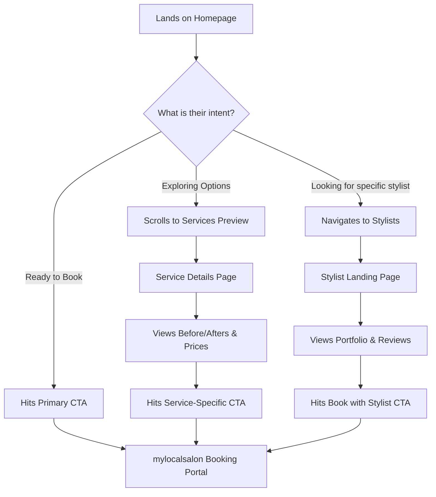

# 8. UX + Conversion Optimization Strategy

## User Flow Diagram (The Perfect Path)

## Booking Flow Optimization Ideas
Since the salon uses an external booking portal (`mylocalsalon.com v7410`), the goal of the Hair Symmetry site is to pre-qualify and \"warm up\" the user before they bounce over.
- **Deep Linking**: Do not just link to the generic booking screen. Try to link directly to the specific service or stylist via URL parameters if `mylocalsalon` supports it.
- **Micro-Friction Removal**: Clearly state \"No card required to book\" or \"Cancel up to 24hrs ahead\" directly below the CTA button to lower anxiety before leaving the site.

## Scroll Path and Attention Zones (Homepage)
- **Top 100% VH (Above Fold)**: Highest attention. Must answer \"What is this?\" and \"How do I buy it?\" instantly.
- **25% Scroll (Social Proof)**: Users scanning for validation. Star ratings must be highly visible here.
- **50% Scroll (Services)**: Scan-heavy area. Users look at imagery more than text. Use clear icons or distinct photos for each service.
- **75% Scroll (Stylists)**: Personal connection zone. Users pause to read names and specialties.

## Cross-Sell UX Strategies
- **Service to Product**: On the *Balayage* page, include a block: \"Protect Your Color at Home\" featuring Olaplex No. 4.
- **Product to Service**: On the *Olaplex* product page, include a block: \"Experience a professional Olaplex treatment. Book with our Master Stylists.\"
- **In-Cart / Post-Booking Recommendations**: While we can\'t control the external portal, any internal checkout for products should suggest adding a minor service (like a conditioning treatment) to their next visit.

## Trust Signals Strategy
- **Badges**: \"Established 1982\", \"Olaplex Certified\", \"Eco-Safe Salon\". Place these globally in the footer and prominently on the homepage hero.
- **Review Integration**: Pull in live Google Reviews via API rather than static typing to prove authenticity.
- **Visual Evidence**: All \"Before/After\" photos must look authentic, well-lit, and un-filtered. Overly polished stock photos destroy trust in the beauty industry.
